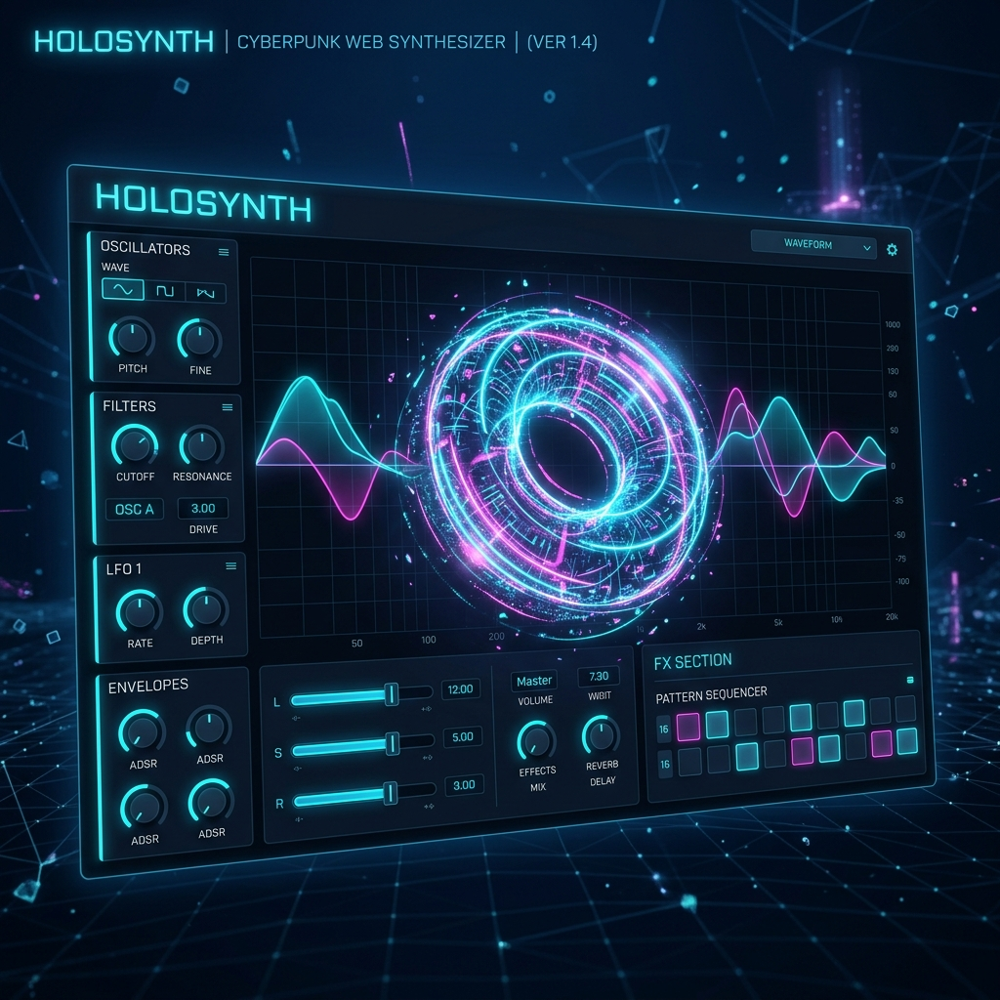
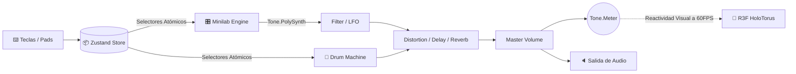

<div align="center">



# 🌌 HoloSynth Pro

**Sintetizador Virtual y Estación de Producción — Inspirado en Arturia Minilab 3**

[](https://www.typescriptlang.org/)
[](https://reactjs.org/)
[](https://threejs.org/)
[](https://tonejs.github.io/)
[](https://github.com/pmndrs/zustand)

</div>

<br/>

## 🎯 Visión General

**HoloSynth Pro** evoluciona el concepto original hacia una bestia de producción en el navegador. Emula la arquitectura y controles del **Arturia Minilab 3** utilizando la **Web MIDI API** y un motor DSP de vanguardia construido sobre `Tone.js`. Todo ello, envuelto en un entorno 3D holográfico reactivo que respira al ritmo de tu música.

## 🚀 Características Principales (Arquitectura Minilab)

- **🎹 Motor PolySynth:** Osciladores *fatsawtooth* polifónicos con ruteo de efectos de nivel de estudio (Filtros Lowpass, LFO, Distorsión, Delay, Reverb).
- **🎛️ Modulación Virtual:** Envolvente ADSR mapeada a Faders y matriz de modulación mapeada a Knobs y Strips virtuales.
- **🥁 Drum Machine TR-808:** Síntesis pura (cero samples externos) para 8 pads de percusión reactivos (Kick, Snare, Hats, Toms, Clap, Crash).
- **🎥 HoloTorus Reactivo:** El fondo 3D no es un video. Es un renderizado en tiempo real (R3F) conectado directamente a la salida Master de audio mediante un nodo `Tone.Meter`. El holograma, las partículas y el *bloom* cinematográfico laten y cambian de color matemáticamente.
- **⚡ Estado Atómico:** Gestión de latencia ultra-baja gestionado por `Zustand`. La UI y el motor de sonido se suscriben atómicamente evitando re-renders en el hilo principal.

## 🧠 Arquitectura DSP & Ruteo



## 🛠️ Stack Tecnológico

| Módulo | Tecnología | Propósito |
|---|---|---|
| **Motor de Audio DSP** | `Tone.js` | Síntesis, routing, generadores de ruido puro. |
| **Entorno 3D** | `@react-three/fiber` + `postprocessing` | Renderizado, Bloom extremo, viñeta cinematográfica. |
| **Control de Estado** | `Zustand` | Evita bloqueos en el UI, conectando el teclado al motor. |
| **Interacción** | `Web MIDI API` (Próximamente) | Soporte nativo para conectar tu propio Minilab físico. |

## 🚦 Puesta en Marcha

Arranca el motor de audio en tu máquina local. Se requiere soporte para WebGL 2.0 y Web Audio API.

```bash
# Instalar dependencias
npm install

# Lanzar entorno de producción / desarrollo
npm run dev
```
*(Haz click en la pantalla al iniciar para activar el AudioContext del navegador).*

## 🎹 Atajos Rápidos (Testing Mode)

Para probar el motor DSP inmediatamente antes de conectar un teclado MIDI, utiliza el modo **QWERTY Piano**:

- **Teclas Blancas:** `A`, `S`, `D`, `F`, `G`, `H`, `J`, `K`
- **Teclas Negras:** `W`, `E`, `T`, `Y`, `U`

*Nota: Al presionar una tecla, el Toroide Holográfico central vibrará, expandirá su escala y cambiará su espectro cromático entre Cyan y Magenta reactivamente.*

---

<div align="center">
  <p>Construido por <b>DeepSeek V4 Pro</b> & <b>Gemini 3.1 Pro</b> con amor por el sonido sintético.</p>
</div>
