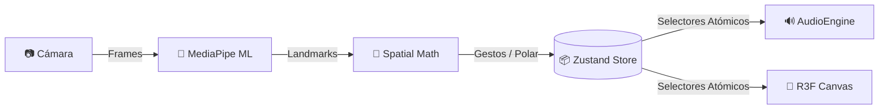

<div align="center">


# 🌌 HoloSynth

**Sintetizador Espacial de Última Generación Controlado por Visión Artificial**

[](https://www.typescriptlang.org/)
[](https://reactjs.org/)
[](https://threejs.org/)
[](https://developers.google.com/mediapipe)
[](https://tonejs.github.io/)
[](https://github.com/pmndrs/zustand)

</div>

<br/>

## 🎯 Visión General

**HoloSynth** rompe la barrera entre el espacio físico y el audio digital. Es un instrumento interactivo web que utiliza algoritmos de **Machine Learning (MediaPipe)** para trackear tus manos en tiempo real, permitiéndote esculpir sonido y manipular entornos 3D sin tocar hardware físico. 

Diseñado bajo una estética **Cyberpunk / Holográfica**, HoloSynth proporciona latencia ultra-baja y una abstracción robusta mediante un pipeline 100% *client-side*.

## 🚀 Características Principales

- **🖐️ Tracking Espacial Zero-Touch:** Detección sub-milimétrica usando la webcam para calcular coordenadas polares 3D de las manos.
- **🎹 Motor de Síntesis Polifónica:** Basado en `Tone.js`, mapeando ángulos a notas (escala pentatónica/dórica) y radios a filtros LPF/VCA.
- **🎥 Escena 3D Reactiva:** Motor gráfico con `Three.js` y `@react-three/fiber` que reacciona paramétricamente a tus gestos y audio.
- **🎛️ Looper Cinético:** Sistema de grabación/reproducción por gestos (pellizco, puño abierto) con feedback visual de formas de onda.
- **⚡ Rendimiento Incondicional:** Store atómico con `Zustand` para evitar re-renders y delegación de cálculos ML fuera del thread principal de React.

## 🧠 Arquitectura de Datos

El sistema respeta una separación estricta de responsabilidades (Clean Architecture en Frontend), dividiendo el flujo en: **Visión**, **Audio** y **Render 3D**.



> **Nota de Rendimiento:** El tracking de visión artificial ocurre fuera del ecosistema de React mediante `requestAnimationFrame`, actualizando selectores atómicos. La escena visual no penaliza el pipeline de audio.

## 🛠️ Stack Tecnológico

| Módulo | Tecnología | Propósito |
|---|---|---|
| **Core / UI** | `React 19` + `Vite` | Componentización y App Shell. |
| **State** | `Zustand` | Almacenamiento rápido y libre de boilerplate. |
| **Visión ML** | `@mediapipe/tasks-vision` | Landmark detection & Gesture mapping. |
| **Audio** | `Tone.js` | Motor de síntesis analógica emulada y ruteo DSP. |
| **3D & Visuales**| `@react-three/fiber` + `drei` | Renderizado, post-procesado (Bloom, Aberración). |

## 🚦 Puesta en Marcha

Dado que el motor maneja WASM y acceso a hardware, requiere un entorno seguro (localhost o HTTPS).

### Prerrequisitos
- Node.js `v20+`
- Cámara Web habilitada.

### Instalación

```bash
# 1. Clonar el repositorio e ingresar
git clone https://github.com/Tokyotech/HoloSynth.git
cd HoloSynth

# 2. Instalar dependencias
npm install

# 3. Lanzar servidor de desarrollo
npm run dev
```

El proyecto estará disponible en `http://localhost:5173`. 
*(El navegador solicitará permisos de cámara para arrancar el engine).*

## 🎹 Guía de Gestos y Uso

### Mano Derecha (Control Tonal)
- **Ángulo (Rotación circular):** Selecciona la nota (escala pre-cargada en el toroide).
- **Radio (Acercar/Alejar del centro):** Controla el filtro Low-Pass y la intensidad de volumen (VCA).
- *Al ocultar la mano, el sintetizador hace release automático.*

### Mano Izquierda (Control del Looper)
- 🤏 **Pinch (Pellizco):** Inicia la grabación del loop. Al soltar (`open`), arranca el playback.
- ✊ **Fist (Puño cerrado):** Mutea (silencia) el looper temporalmente, desaturando la escena 3D.
- 🖐️ **Open (Palma abierta):** Desmutea el loop.

---

<div align="center">
  <p>Construido con disciplina algorítmica y amor por el sonido espacial.</p>
</div>
